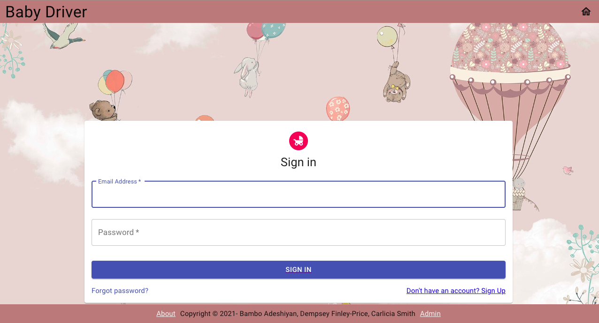
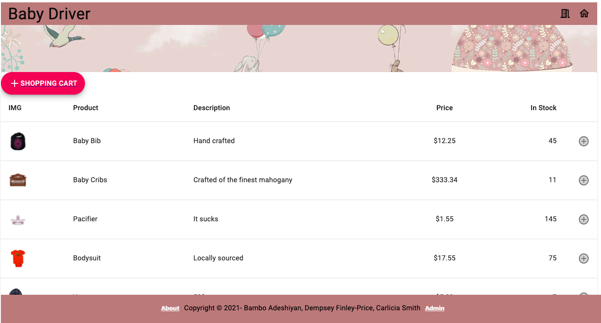
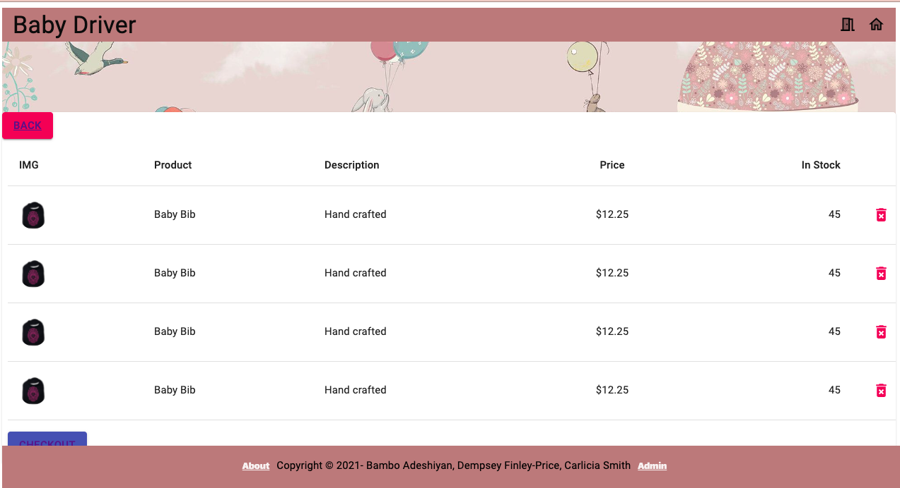
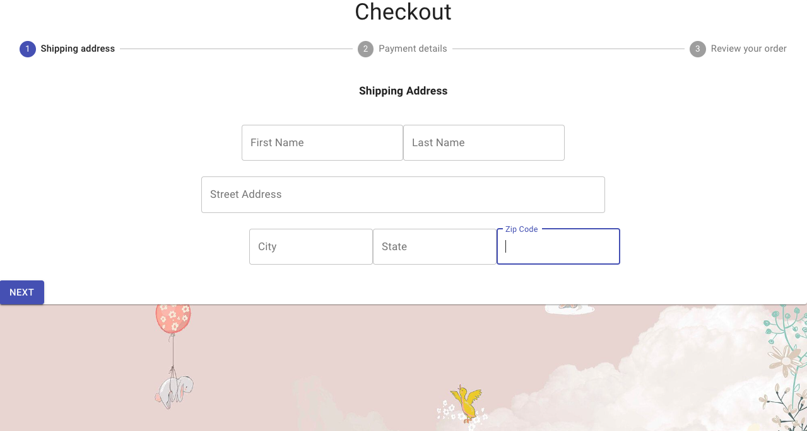

# Baby Driver

## Description :

Baby Driver is an application built for parents to order baby supplies and having it delivered to their door without having to leave the safety of their home amid the current COVID climate.

## Table of Contents :
* [Description](#Description)
* [Installation](#Installation)
* [Usage](#Uuage)
* [Technologies](#Technologies)
* [Screenshots](#Screenshots)
* [Deployment](#Deployment)
* [Github Repo](#GithubRepo)
* [Credits](#Credits)
* [License](#License)
* [Badge](#Badge)
* [Contributors](#Contributors)
* [Tests](#Tests)

## Installation :
1. Open link in [Github](https://github.com/badeshiyan/project-3.git).
2. Clone with SSH Key from the repo.
3. Run git clone command in Terminal with the pasted link.
4. Run code . command to open in VS Code.
5. Run npm install to install all dependencies
6. Run npm start to initialize the server on your local.

## Usage :

## Technologies:
* MongoDB
* Express.js
* React.js
* Node.js
* Material-UI
* Heroku

## Screenshots

### Login

### Home

### Shopping Cart

### Checkout

## Deployment:

[Deployed Link](https://babydriver66.herokuapp.com/)

## Github Repo:
[Repo](https://github.com/badeshiyan/project-3.git)

## Credits : 
* Bambo: Backend
* Carlicia: Frontend
* Dempsey: Backend

## Contributors :
* Bambo
* Carlicia
* Dempsey

## Questions :
 If you want to contact us :

 Bambo 
* [Github](https://github.com/badeshiyan)
* [LinkedIn](https://www.linkedin.com/in/badeshiyan/)
* Email : badeshiyan@gmail.com

Carlicia
* [Github](https://github.com/smith-carlicia)
* [LinkedIn](https://www.linkedin.com/in/carlicia-smith-613194b4/)
* Email : smith.carlicia@gmail.com

Dempsey 
* [Github](https://github.com/Dempsey496)
* [LinkedIn](https://www.linkedin.com/in/dempsey-finley-price-81ba651b3/)
* Email : dempseyfinley@gmail.com

